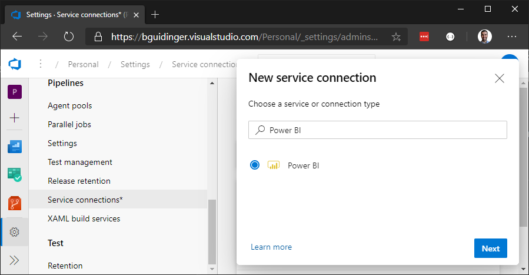
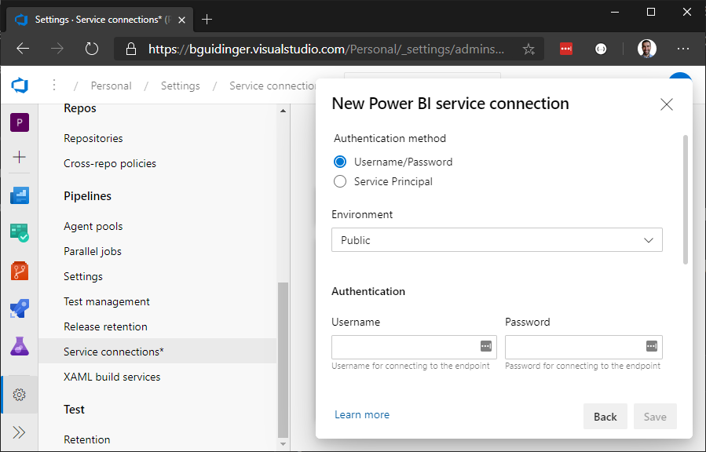
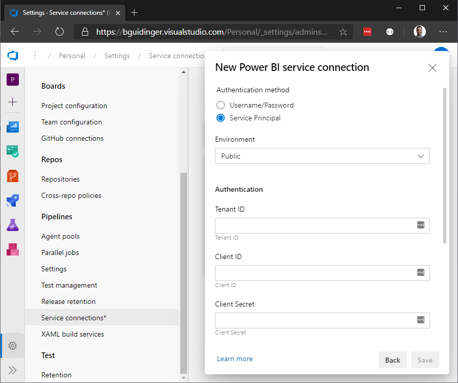

# Getting Started


## Installation
The Power BI Build Tools are installed by adding them to your organization through the [Visual Studio Marketplace](https://marketplace.visualstudio.com/items?itemName=bguidinger.powerbi-build-tools).

## Connection

Before you can use the tasks, you must create a new Service Connection to Power BI. To do this, navigate to your project settings in Azure DevOps and click on Service connections, find Power BI, and click Next.



Choose your authentication method:

### Username/Password

Users with Multi-Factor Authentication (MFA) enabled are _not_ supported. Please consider using a Service Principal instead.



### Service Principal

To setup/configure a service principal with Power BI, follow [these](https://docs.microsoft.com/en-us/power-bi/developer/embedded/embed-service-principal) steps.




## Pipelines

In all pipelines, the `Power BI Tool Installer` task must come before any other Power BI tasks.

Here are some examples to get you started.

### Reports

#### Moving to a higher environment
This scenario is useful when you create/update a report in a Development workspace and you want to promote those changes to a higher enivonment (QA, UAT, Production).

```
steps:
- task: PowerBIToolInstaller@1
  displayName: 'Power BI Tool Installer'
- task: PowerBIExport@1
  displayName: 'Power BI Export: Report'
  inputs:
    connection: 'Power BI'
    workspace: 'Workspace **(DEV)**'
    name: 'Report'
    path: '$(Build.StagingDirectory)'
- task: PowerBIImport@1
  displayName: 'Power BI Import: Report'
  inputs:
    connection: 'Power BI'
    workspace: 'Workspace **(PROD)**'
    path: '$(Build.StagingDirectory)/Report.pbix'
```

### Paginated Reports

#### Moving to a higher environment

In this scenario, the paginated report files (.rdl) exist in source control under `src/Reports`, and each report has two connection managers named Connection1 and Connection2.

```
steps:
- task: PowerBIToolInstaller@1
  displayName: 'Power BI Tool Installer'
- task: PowerBIImport@1
  displayName: 'Power BI Import: Paginated Reports'
  inputs:
    connection: 'Power BI'
    workspace: 'Workspace (PROD)'
    path: src/Reports
    connectionStrings: '{"Connection1":"$(Connection1)","Connection2":"$(Connection2)"}'
```

### Add Users

In this scenario, a new workspace is created, Contributor permissions are added for `user@domain.com`, and the permissions are refreshed (so they apply immediately).

```
steps:
- task: PowerBICreate@1
  displayName: 'Power BI Create: Workspace'
  inputs:
    connection: 'Power BI'
    name: 'Workspace (PROD)'
- task: PowerBIPermissions@1
  displayName: 'Power BI Permissions: Workspace'
  inputs:
    connection: 'Power BI'
    workspace: 'Workspace (PROD)'
    action: Add
    principalType: User
    principal: 'user@domain.com'
    permission: Contributor
- task: PowerBIPermissions@1
  displayName: 'Power BI Permissions: Workspace'
  inputs:
    connection: 'Power BI'
    workspace: 'Workspace (PROD)'
    action: Refresh
```